# 🖥️ 나만의 채용 서비스 백엔드 서버 만들기


## 프로젝트 소개
- 프로젝트 이름 : SPA_Recruit
- 내용 : Express.js, MySQL을 활용해 나만의 채용 서비스 백엔드 서버 만들기
- 구분 : 개인 프로젝트
- 배포 : https://www.mymycode.shop/api/... (API 명세서 참조)
    <details>
    <summary>RECRUITER 정보</summary>
    <div markdown="1">
    <ul>
    <li>email : spartan@spartacodingclub.kr</li>
    <li>password : aaaa4321!!</li>
    </ul>
    </div>
    </details>

<br>


## 1. 개발 기간
- 2024.05.27 ~ 2024.05.29

<br>

## 2. 개발 환경
- BackEnd : Node.js, Express, MySQL(Prisma)
- Tool : AWS, Insomnia, MySQL Workbench

<br>

## 3. API 명세서 및 ERD
 - API 명세서 : https://west-territory-778.notion.site/Node-js-API-ec55e0bdd9c24242a75c99766c90589e?pvs=4
 - ERD : https://drawsql.app/teams/nodejs-express/diagrams/spa-recruit

<br>

## 4. 주요 기능 및 설명
### 4-1. DB 연결, 스키마 작성, 테이블 생성
- 데이터베이스 연결
```javascript
// src/utils/prisma.util.js

import { PrismaClient } from '@prisma/client';

export const prisma = new PrismaClient({
    // Prisma를 이용해 데이터베이스를 접근할 때, SQL을 출력해줍니다.
    log: ['query', 'info', 'warn', 'error'],

    // 에러 메시지를 평문이 아닌, 개발자가 읽기 쉬운 형태로 출력해줍니다.
    errorFormat: 'pretty',
}); // PrismaClient 인스턴스를 생성합니다.

try {
    await prisma.$connect();
    console.log('DB 연결에 성공했습니다.');
} catch (error) {
    console.error('DB 연결에 실패했습니다.', error);
}
```
- 스키마 작성 및 테이블 생성
```javascript
// prisma/schema.prisma

// This is your Prisma schema file,
// learn more about it in the docs: https://pris.ly/d/prisma-schema

// Looking for ways to speed up your queries, or scale easily with your serverless or edge functions?
// Try Prisma Accelerate: https://pris.ly/cli/accelerate-init

generator client {
  provider = "prisma-client-js"
}

datasource db {
  provider = "mysql"
  url      = env("DATABASE_URL")
}

model Users {
  userId       Int      @id @default(autoincrement()) @map("userId")
  email        String   @map("email")
  password     String   @map("password")
  name         String   @map("name")
  age          Int      @map("age")
  gender       String   @map("gender")
  role         String   @default("APPLICANT") @map("role")
  profileImage String   @map("profileImage")
  createdAt    DateTime @default(now()) @map("createdAt")
  updatedAt    DateTime @updatedAt @map("updatedAt")

  Resume Resumes[] // 1명의 사용자는 여러 개의 이력서 작성 가능 (1:N 관계 형성)

  @@map("Users")
}

model Resumes {
  resumeId  Int      @id @default(autoincrement()) @map("resumeId")
  UserId    Int      @map("UserId") // Users 테이블을 참조하는 외래키
  title     String   @map("title")
  introduce String   @map("introduce") @db.Text
  state     String   @default("APPLY") @map("state")
  createdAt DateTime @default(now()) @map("createdAt")
  updatedAt DateTime @updatedAt @map("updatedAt")

  ResumeHistory ResumeHistories[] // 1개의 이력서에는 여러 개의 이력서 로그 기록이 존재 (1:N 관계 형성)

  // Users 테이블과의 관계 설정
  User Users @relation(fields: [UserId], references: [userId], onDelete: Cascade)

  @@map("Resumes")
}

model ResumeHistories {
  resumeLogId Int      @id @default(autoincrement()) @map("resumeLogId")
  ResumeId    Int      @map("ResumeId") // Resumes 테이블을 참조하는 외래키
  RecruiterId Int      @map("RecruiterId")
  oldState    String   @map("oldState")
  newState    String   @map("newState")
  reason      String   @map("reason")
  createdAt   DateTime @default(now()) @map("createdAt")

  // Resumes 테이블과의 관계 설정
  Resume Resumes @relation(fields: [ResumeId], references: [resumeId], onDelete: Cascade)

  @@map("ResumeHistories")
}
```

<br>

### 4-2. 유효성 검증 (Joi)
- 회원가입, 로그인, 이력서 작성 등 사용하는 유효성 검사가 달라서 따로 구현
```javascript
// src/schemas/joi.schema.js

import Joi from 'joi';
import { USER_GENDER } from '../constants/user.gender.constant.js';

// 회원가입 유효성 검사
export const signUpSchema = Joi.object({
    email: Joi.string()
        .email({ minDomainSegments: 2, tlds: { allow: ['com', 'net', 'kr'] } })
        .required()
        .messages({
            'string.base': '이메일은 문자열이어야 합니다.',
            'string.empty': '이메일을 입력해주세요.',
            'string.email': '이메일의 형식이 올바르지 않습니다',
            'any.required': '이메일을 입력해주세요.',
        }),
    password: Joi.string().required().pattern(new RegExp('^(?=.*[a-zA-Z])(?=.*[!@#$%^*+=-])(?=.*[0-9]).{6,15}$')).messages({
        'string.base': '비밀번호는 문자열이어야 합니다.',
        'string.empty': '비밀번호를 입력해주세요.',
        'any.required': '비밀번호를 입력해주세요.',
        'string.pattern.base': '비밀번호가 형식에 맞지 않습니다. (영문, 숫자, 특수문자 포함 6~15자)',
    }),
    passwordConfirm: Joi.string().required().pattern(new RegExp('^(?=.*[a-zA-Z])(?=.*[!@#$%^*+=-])(?=.*[0-9]).{6,15}$')).messages({
        'string.base': '비밀번호 확인은 문자열이어야 합니다.',
        'string.empty': '비밀번호 확인을 입력해주세요.',
        'any.required': '비밀번호 확인을 입력해주세요.',
        'string.pattern.base': '비밀번호 확인의 형식이 맞지 않습니다. (영문, 숫자, 특수문자 포함 6~15자)',
    }),
    name: Joi.string().required().messages({
        'string.base': '이름은 문자열이어야 합니다.',
        'string.empty': '이름을 입력해주세요.',
        'any.required': '이름을 입력해주세요.',
    }),
    age: Joi.number().integer().required().messages({
        'number.base': '나이는 정수를 입력해주세요.',
        'any.required': '나이를 입력해주세요.',
    }),
    gender: Joi.string()
        .valid(...Object.values(USER_GENDER))
        .required()
        .messages({
            'string.base': '성별은 문자열이어야 합니다.',
            'any.only': '성별은 [MALE, FEMALE] 중 하나여야 합니다.',
        }),
    profileImage: Joi.string().required().messages({
        'string.base': '프로필 사진은 문자열이어야 합니다.',
        'string.empty': '프로필 사진을 입력해주세요.',
        'any.required': '프로필 사진을 입력해주세요.',
    }),
});

// 로그인 유효성 검사
export const signInSchema = Joi.object({
    email: Joi.string()
        .email({ minDomainSegments: 2, tlds: { allow: ['com', 'net', 'kr'] } })
        .required()
        .messages({
            'string.base': '이메일은 문자열이어야 합니다.',
            'string.empty': '이메일을 입력해주세요.',
            'string.email': '이메일의 형식이 올바르지 않습니다',
            'any.required': '이메일을 입력해주세요.',
        }),
    password: Joi.string().required().pattern(new RegExp('^(?=.*[a-zA-Z])(?=.*[!@#$%^*+=-])(?=.*[0-9]).{6,15}$')).messages({
        'string.base': '비밀번호는 문자열이어야 합니다.',
        'string.empty': '비밀번호를 입력해주세요.',
        'any.required': '비밀번호를 입력해주세요.',
        'string.pattern.base': '비밀번호가 형식에 맞지 않습니다. (영문, 숫자, 특수문자 포함 6~15자)',
    }),
});

// 이력서 작성 유효성 검사
export const resumeWriteSchema = Joi.object({
    title: Joi.string().required().messages({
        'string.base': '제목은 문자열이어야 합니다.',
        'string.empty': '제목을 입력해주세요.',
        'any.required': '제목을 입력해주세요.',
    }),
    introduce: Joi.string().min(150).required().messages({
        'string.base': '제목은 문자열이어야 합니다.',
        'string.min': '자기소개는 150자 이상 작성해야 합니다.',
        'string.empty': '제목을 입력해주세요.',
        'any.required': '제목을 입력해주세요.',
    }),
});
```

<br>

### 4-3. 회원가입 API
- 이메일, 비밀번호, 비밀번호 확인, 이름을 Request Body(`req.body`)로 전달 받음

- **Joi**를 통한 유효성 검사

- 사용자 ID, 역할, 생성일시, 수정일시는 자동 생성됨

- 보안을 위해 **비밀번호**는 평문(Plain Text)으로 저장하지 않고 **Hash** 된 값을 저장
```javascript
// src/routers/auth.router.js

// 회원가입 API
router.post('/auth/sign-up', async (req, res, next) => {
    try {
        // 사용자 입력 유효성 검사
        const validation = await signUpSchema.validateAsync(req.body);
        const { email, password, passwordConfirm, name, age, gender, profileImage } = validation;

        // 이메일 중복 확인
        const isExistUser = await prisma.users.findFirst({ where: { email } });
        if (isExistUser) {
            return res.status(400).json({ status: 400, message: '이미 가입 된 사용자입니다.' });
        }

        // 비밀번호 확인 결과
        if (password !== passwordConfirm) {
            return res.status(400).json({ status: 400, message: '입력 한 두 비밀번호가 일치하지 않습니다.' });
        }

        // 비밀번호 암호화
        const hashedPassword = await bcrypt.hash(password, 10);

        // 사용자 생성
        const user = await prisma.users.create({
            data: {
                email,
                password: hashedPassword,
                name,
                age,
                gender: gender.toUpperCase(),
                profileImage,
            },
        });

        const { password: pw, ...userData } = user;

        return res.status(201).json({ status: 201, message: '회원가입에 성공했습니다.', data: { userData } });
    } catch (err) {
        next(err);
    }
});
```

<br>

### 4-4. 로그인 API
- 이메일, 비밀번호를 Request Body(`req.body`)로 전달 받음

- **Joi**를 통한 유효성 검사

- **AccessToken**(Payload에 `사용자 ID`를 포함하고, 유효기한이 `12시간`)을 생성

- **RefreshToken**(Payload에 `사용자 ID`를 포함하고, 유효기한이 `7일`)을 생성

- 데이터베이스에 **RefreshToken**을 **생성** 또는 **갱신**
```javascript
// src/routers/auth.router.js

// 로그인 API
router.post('/auth/sign-in', async (req, res, next) => {
    try {
        const validation = await signInSchema.validateAsync(req.body);
        const { email, password } = validation;

        // 입력받은 이메일로 사용자 조회
        const user = await prisma.users.findFirst({ where: { email } });
        if (!user) {
            return res.status(401).json({ status: 401, message: '인증 정보가 유효하지 않습니다.' });
        }

        // 사용자 비밀번호와 입력한 비밀번호 일치 확인
        if (!(await bcrypt.compare(password, user.password))) {
            return res.status(401).json({ status: 401, message: '인증 정보가 유효하지 않습니다.' });
        }

        // 로그인 성공하면 JWT 토큰 발급
        const AccessToken = jwt.sign({ userId: user.userId }, process.env.ACCESS_TOKEN_SECRET_KEY, { expiresIn: '12h' });
        const RefreshToken = jwt.sign({ userId: user.userId }, process.env.REFRESH_TOKEN_SECRET_KEY, { expiresIn: '7d' });
        // res.setHeader('authorization', `Bearer ${AccessToken}`);

        // 현재 사용자의 Refresh토큰이 DB에 있는지 조회
        const refreshToken = await prisma.refreshTokens.findFirst({ where: { UserId: user.userId } });
        if (!refreshToken) {
            // 없으면 새로운 토큰 생성
            await prisma.refreshTokens.create({
                data: {
                    UserId: user.userId,
                    token: RefreshToken,
                    ip: req.ip,
                    userAgent: req.headers['user-agent'],
                },
            });
        } else {
            // 있으면 토큰 갱신
            await prisma.refreshTokens.update({
                where: { UserId: user.userId },
                data: {
                    token: RefreshToken,
                    ip: req.ip,
                    userAgent: req.headers['user-agent'],
                    createdAt: new Date(Date.now()),
                },
            });
        }

        return res.status(200).json({ status: 200, message: '로그인에 성공했습니다.', data: { AccessToken, RefreshToken } });
    } catch (err) {
        next(err);
    }
});
```


<br>

### 4-5. AccessToken 인증 Middleware
- **AccessToken**을 **Request Header**의 Authorization 값(`req.headers.authorization`)으로 전달 받음

- 조건문과 `try ~ catch문`을 이용해서 유효성 검사

- Payload에 담긴 **사용자 ID**를 이용하여 **사용자 정보를 조회**

- 조회 된 사용자 정보를 `req.user`에 담고, 다음 동작을 진행
```javascript
// src/middlewares/auth.access.token.middleware.js

import { prisma } from '../utils/prisma.util.js';
import jwt from 'jsonwebtoken';

// AccessToken 인증 미들웨어
export default async (req, res, next) => {
    try {
        // 헤더에서 Access 토큰 가져옴
        const authorization = req.headers['authorization'];
        console.log(req.headers);
        if (!authorization) throw new Error('인증 정보가 없습니다.');

        // Access 토큰이 Bearer 형식인지 확인
        const [tokenType, token] = authorization.split(' ');
        if (tokenType !== 'Bearer') throw new Error('지원하지 않는 인증 방식입니다.');

        // 서버에서 발급한 JWT가 맞는지 검증
        const decodedToken = jwt.verify(token, process.env.CUSTOMIZED_SECRET_KEY);
        const userId = decodedToken.userId;

        // JWT에서 꺼낸 userId로 실제 사용자가 있는지 확인
        const user = await prisma.users.findFirst({ where: { userId: +userId } });
        if (!user) {
            return res.status(401).json({ status: 401, message: '인증 정보와 일치하는 사용자가 없습니다.' });
        }

        // 조회된 사용자 정보를 req.user에 넣음
        req.user = user;
        // 다음 동작 진행
        next();
    } catch (err) {
        switch (err.name) {
            case 'TokenExpiredError':
                return res.status(401).json({ status: 401, message: '인증 정보가 만료되었습니다.' });
            case 'JsonWebTokenError':
                return res.status(401).json({ status: 401, message: '인증 정보가 유효하지 않습니다.' });
            default:
                return res.status(401).json({ status: 401, message: err.message ?? '비정상적인 요청입니다.' });
        }
    }
};
```

<br>

### 4-6. 내 정보 조회 API
- 사용자 정보는 인증 Middleware(`req.user`)를 통해서 전달 받음

- userId값으로 **Users 테이블**에서 사용자 정보를 조회

- **사용자 ID, 이메일, 이름, 역할, 생성일시, 수정일시**를 반환
```javascript
// src/routers/users.router.js

// 내 정보 조회 API
router.get('/users', authMiddleware, async (req, res) => {
    const { userId } = req.user;

    const user = await prisma.users.findFirst({
        where: { userId },
        select: {
            userId: true,
            email: true,
            name: true,
            role: true,
            createdAt: true,
            updatedAt: true,
        },
    });

    return res.status(200).json({ message: '내 정보 조회에 성공했습니다.', data: { user } });
});
```


<br>

### 4-7. 이력서 생성 API
- 사용자 정보는 인증 Middleware(`req.user`)를 통해서 전달 받음

- 제목, 자기소개는 Request Body(`req.body`)로 전달 받음

- **Joi**를 통한 유효성 검사

- 이력서 ID, 지원 상태, 생성일시, 수정일시는 자동 생성
```javascript
// src/routers/resumes.router.js

//이력서 생성 API
router.post('/resumes', authMiddleware, async (req, res, next) => {
    try {
        // 사용자 ID를 가져옴
        const { userId } = req.user;
        // 사용자가 입력한 제목과 자기소개에 대한 유효성 검사
        const validation = await resumeWriteSchema.validateAsync(req.body);
        const { title, introduce } = validation;

        // 이력서 생성
        const resume = await prisma.resumes.create({
            data: {
                title,
                introduce,
                UserId: +userId,
            },
        });

        return res.status(201).json({ status: 201, message: '이력서 생성에 성공했습니다.', data: { resume } });
    } catch (err) {
        next(err);
    }
});
```

<br>

### 4-8. 이력서 목록 조회 API
- 사용자 정보는 인증 Middleware(`req.user`)를 통해서 전달 받음

- Query Parameters(`req.query`)으로 정렬 조건을 받음

- Query Parameters(`req.query`)으로 필터링 조건을 받음

- 지원 상태 별 필터링 조건을 받음 ex) `sort=desc&status=APPLY`

- **현재 로그인 한 사용자**가 작성한 이력서 목록만 조회

- **역할**이 `RECRUITER` 인 경우 **모든 사용자의 이력서를 조회**할 수 있음
```javascript
// src/routers/resumes.router.js

// 이력서 목록 조회 API
router.get('/resumes', authMiddleware, async (req, res) => {
    // 사용자를 가져옴
    const user = req.user;
    // 정렬 조건을 req.query로 가져옴
    const sortType = req.query.sort.toLowerCase();
    // 필터링 조건을 가져옴
    const stateFilter = req.query.status.toUpperCase();

    const resumes = await prisma.resumes.findMany({
        where: {
            // AND 배열 연산을 통해서 필터링
            AND: [user.role === 'RECRUITER' ? {} : { UserId: +user.userId }, stateFilter === '' ? {} : { state: stateFilter }],
        },
        select: {
            resumeId: true,
            User: { select: { name: true } },
            title: true,
            introduce: true,
            state: true,
            createdAt: true,
            updatedAt: true,
        },
        orderBy: { createdAt: sortType },
    });

    return res.status(200).json({ status: 200, message: '이력서 목록 조회에 성공했습니다.', data: { resumes } });
});
```

<br>

### 4-9.이력서 상세 조회 API
- 사용자 정보는 인증 Middleware(`req.user`)를 통해서 전달 받음

- 이력서 ID를 Path Parameters(`req.params`)로 전달 받음

- **현재 로그인 한 사용자가 작성한 이력서만** 조회

- **역할**이 `RECRUITER` 인 경우 **이력서 작성 사용자와 일치하지 않아도** 이력서를 조회할 수 있음

- **작성자 ID가 아닌 작성자 이름을 반환**하기 위해 스키마에 정의 한 **Relation을 활용**해 조회 (중첩 SELECT 문법 사용)
```javascript
// src/routers/resumes.router.js

// 이력서 상세 조회 API
router.get('/resumes/:resumeId', authMiddleware, async (req, res) => {
    // 사용자를 가져옴
    const user = req.user;
    // 이력서 ID를 가져옴
    const { resumeId } = req.params;

    // 이력서 ID, 작성자 ID가 모두 일치한 이력서 조회
    const resume = await prisma.resumes.findFirst({
        where: user.role === 'RECRUITER' ? { resumeId: +resumeId } : { resumeId: +resumeId, UserId: +user.userId },
        select: {
            resumeId: true,
            User: { select: { name: true } },
            title: true,
            introduce: true,
            state: true,
            createdAt: true,
            updatedAt: true,
        },
    });
    if (!resume) {
        return res.status(401).json({ status: 401, message: '이력서가 존재하지 않습니다.' });
    }

    return res.status(200).json({ status: 200, message: '이력서 상세 조회에 성공했습니다.', data: { resume } });
});
```

<br>

### 4-10. 이력서 수정 API
- 사용자 정보는 인증 Middleware(`req.user`)를 통해서 전달 받음

- 이력서 ID를 Path Parameters(`req.params`)로 전달 받음

- 제목, 자기소개를 Request Body(`req.body`)로 전달 받음

- **Joi**를 통한 유효성 검사

- **현재 로그인 한 사용자가 작성한 이력서**만 수정할 수 있음

- 이력서 조회 시 **이력서 ID, 작성자 ID가 모두 일치**해야 함
```javascript
// src/routers/resumes.router.js

// 이력서 수정 API
router.patch('/resumes/:resumeId', authMiddleware, async (req, res, next) => {
    try {
        // 사용자 ID를 가져옴
        const { userId } = req.user;
        // 이력서 ID를 가져옴
        const { resumeId } = req.params;
        // 제목, 자기소개를 가져옴 (유효성 검사 진행)
        const validation = await resumeWriteSchema.validateAsync(req.body);
        const { title, introduce } = validation;

        // 이력서 ID, 작성자 ID가 모두 일치한 이력서 조회
        const resume = await prisma.resumes.findFirst({
            where: { resumeId: +resumeId, UserId: +userId },
        });
        if (!resume) {
            return res.status(401).json({ status: 401, message: '이력서가 존재하지 않습니다.' });
        }

        // 이력서 수정
        const updatedResume = await prisma.resumes.update({
            where: { resumeId: +resumeId, UserId: +userId },
            data: { title, introduce },
        });

        return res.status(201).json({ status: 201, message: '이력서 수정이 성공했습니다.', data: { updatedResume } });
    } catch (err) {
        next(err);
    }
});
```

<br>

### 4-11. 이력서 삭제 API
- 사용자 정보는 인증 Middleware(`req.user`)를 통해서 전달 받음

- 이력서 ID를 Path Parameters(`req.params`)로 전달 받음

- **현재 로그인 한 사용자가 작성한 이력서만** 삭제

- 이력서 조회 시 **이력서 ID, 작성자 ID가 모두 일치**해야 함

- DB에서 이력서 정보를 직접 삭제
```javascript
// src/routers/resumes.router.js

// 이력서 삭제 API
router.delete('/resumes/:resumeId', authMiddleware, async (req, res, next) => {
    try {
        // 사용자 ID를 가져옴
        const { userId } = req.user;
        // 이력서 ID를 가져옴
        const { resumeId } = req.params;

        // 이력서 ID, 작성자 ID가 모두 일치한 이력서 조회
        const resume = await prisma.resumes.findFirst({
            where: { resumeId: +resumeId, UserId: +userId },
        });
        if (!resume) {
            return res.status(401).json({ status: 401, message: '이력서가 존재하지 않습니다.' });
        }
        const deletedResume = await prisma.resumes.delete({
            where: { resumeId: +resumeId, UserId: +userId },
            select: { resumeId: true },
        });

        return res.status(201).json({ status: 201, message: '이력서 삭제가 성공했습니다.', data: { deletedResume } });
    } catch (err) {
        next(err);
    }
});
```

<br>

### 4-12. 역할 인가 Middleware
- 사용자 정보는 인증 Middleware(`req.user`)를 통해서 전달 받음

- 허용 역할은 Middleware 사용 시 배열로 전달 받음
```javascript
// src/middlewares/role.middleware.js

// 미들웨어는 req, res, next를 필요로 하는 함수
// 그렇기에 매개변수를 사용할 수 있는 미들웨어를 만들기 위해 미들웨어를 리턴하는 함수를 만듦
export const requiredRoles = (roles) => {
    return async (req, res, next) => {
        // 현재 사용자의 역할을 가져옴
        const { role } = req.user;

        // 배열로 받아온 roles에 현재 사용자의 역할이 포함되는지 확인
        if (roles.includes(role)) {
            // 역할이 포함되면 다음으로 진행
            return next();
        }
        return res.status(401).json({ status: 401, message: '접근 권한이 없습니다.' });
    };
};
```

<br>

### 4-13. 이력서 지원 상태 변경 API
- 사용자 정보는 인증 Middleware(`req.user`)를 통해서 전달 받음

- **이력서 ID**를 Path Parameters(`req.params`)로 전달 받음

-  **지원 상태, 사유**를 **Request Body**(**`req.body`**)로 전달 받음

- 이력서 정보 수정과 이력서 로그 생성을 **Transaction**으로 묶어서 실행
```javascript
// src/routers/resumes.router.js

// 이력서 지원 상태 변경 API
router.patch('/resumes/:resumeId/state', authMiddleware, requiredRoles(Object.values(USER_ROLE)), async (req, res, next) => {
    try {
        // 사용자 정보 가져옴
        const { userId } = req.user;
        // 이력서 ID 가져옴
        const { resumeId } = req.params;
        //지원 상태, 사유 가져옴
        const validation = await resumeStateSchema.validateAsync(req.body);
        const { state, reason } = validation;

        // 이력서가 존재하는지 조회
        const resume = await prisma.resumes.findFirst({ where: { resumeId: +resumeId } });
        if (!resume) {
            return res.status(401).json({ status: 401, message: '이력서가 존재하지 않습니다.' });
        }

        let resumeLog; // 이력서 변경 로그

        // 트랜젝션을 통해서 작업의 일관성 유지
        await prisma.$transaction(
            async (tx) => {
                // 이력서 수정
                const updatedResume = await tx.resumes.update({ where: { resumeId: +resumeId }, data: { state } });

                // 이력서 변경 로그 생성
                resumeLog = await tx.resumeHistories.create({
                    data: {
                        RecruiterId: +userId,
                        ResumeId: +resumeId,
                        oldState: resume.state,
                        newState: updatedResume.state,
                        reason,
                    },
                });
            },
            {
                isolationLevel: Prisma.TransactionIsolationLevel.ReadCommitted,
            },
        );

        return res.status(201).json({ status: 201, message: '지원 상태 변경에 성공했습니다.', data: { resumeLog } });
    } catch (err) {
        next(err);
    }
});
```

<br>

### 4-14. 이력서 로그 목록 조회 API
- **이력서 ID**를 Path Parameters(`req.params`)로 전달 받음

- **생성일시** 기준 **최신순**으로 조회

- **채용 담당자 이름**을 반환하기 위해 스키마에 정의 한 **Relation**을 활용해 조회
```javascript
// src/routers/resumes.router.js

// 이력서 로그 목록 조회 API
router.get('/resumes/:resumeId/log', authMiddleware, requiredRoles(Object.values(USER_ROLE)), async (req, res, next) => {
    // 이력서 ID 가져옴
    const { resumeId } = req.params;

    // 이력서 로그 조회
    const resumeLogs = await prisma.resumeHistories.findMany({
        where: { ResumeId: +resumeId },
        select: {
            resumeLogId: true,
            Resume: {
                select: {
                    User: {
                        select: {
                            name: true,
                        },
                    },
                },
            },
            ResumeId: true,
            oldState: true,
            newState: true,
            reason: true,
            createdAt: true,
        },
        orderBy: { createdAt: 'desc' },
    });

    return res.status(200).json({ status: 200, message: '이력서 로그 목록 조회에 성공했습니다.', data: { resumeLogs } });
});
```

<br>

### 4-15. RefreshToken 인증 Middleware
- **AccessToken** 인증 미들웨어와 거의 동일함

- **RefreshToken**을 **Request Header의 Authorization** 값(**`req.headers.authorization`**)으로 전달 받음

- Payload에 담긴 **사용자 ID**를 이용하여 **사용자 정보를 조회**

- 이 때, RefreshToken은 DB에 보관하기 때문에 DB에 접근해서 조회

- Payload에 담긴 사용자 ID와 일치하는 사용자가 없는 경우에는 `폐기 된 인증 정보입니다` 라고 출력
```javascript
// src/middlewares/auth.refresh.token.middleware.js

// RefreshToken 인증 미들웨어
export default async (req, res, next) => {
    try {
        // 헤더에서 Refresh 토큰 가져옴
        const authorization = req.headers['authorization'];
        if (!authorization) throw new Error('인증 정보가 없습니다.');

        // Refresh 토큰이 Bearer 형식인지 확인
        const [tokenType, token] = authorization.split(' ');
        if (tokenType !== 'Bearer') throw new Error('지원하지 않는 인증 방식입니다.');

        // 서버에서 발급한 JWT가 맞는지 검증
        const decodedToken = jwt.verify(token, process.env.REFRESH_TOKEN_SECRET_KEY);
        const userId = decodedToken.userId;

        // JWT에서 꺼낸 userId로 실제 사용자가 있는지 확인
        const user = await prisma.users.findFirst({ where: { userId: +userId } });
        if (!user) {
            return res.status(401).json({ status: 401, message: '인증 정보와 일치하는 사용자가 없습니다.' });
        }

        // DB에 저장된 RefreshToken를 조회
        const refreshToken = await prisma.refreshTokens.findFirst({ where: { UserId: user.userId } });
        // DB에 저장 된 RefreshToken이 없거나 전달 받은 값과 일치하지 않는 경우
        if (!refreshToken || refreshToken.token !== token) {
            return res.status(401).json({ status: 401, message: '폐기 된 인증 정보입니다.' });
        }

        // 조회된 사용자 정보를 req.user에 넣음
        req.user = user;
        // 다음 동작 진행
        next();
    } catch (err) {
        switch (err.name) {
            case 'TokenExpiredError':
                return res.status(401).json({ status: 401, message: '인증 정보가 만료되었습니다.' });
            case 'JsonWebTokenError':
                return res.status(401).json({ status: 401, message: '인증 정보가 유효하지 않습니다.' });
            default:
                return res.status(401).json({ status: 401, message: err.message ?? '비정상적인 요청입니다.' });
        }
    }
};
```

<br>

### 4-16. 토큰 재발급 API
- AccessToken 만료 시 RefreshToken을 활용해 재발급

- **RefreshToken**(JWT)을 **Request Header의 Authorization** 값(**`req.headers.authorization`**)으로 전달 받음

- 사용자 정보는 인증 Middleware(`req.user`)를 통해서 전달 받음 

- **AccessToken(Payload**에 `사용자 ID`를 포함하고, **유효기한**이 `12시간`)을 재발급

- **RefreshToken** (**Payload**: **사용자 ID** 포함, **유효기한**: **`7일`**)을 재발급

- RefreshToken은 **DB에서 보관**하기 때문에 DB의 데이터를 갱신
```javascript
// src/routers/auth.router.js

// 토큰 재발급 API
router.post('/auth/refresh', authRefreshTokenMiddleware, async (req, res, next) => {
    try {
        // 사용자 정보 가져옴
        const user = req.user;

        // Access Token 재발급 (12시간)
        const AccessToken = jwt.sign({ userId: user.userId }, process.env.ACCESS_TOKEN_SECRET_KEY, { expiresIn: '12h' });

        // Refresh Token 재발급 (7일)
        const RefreshToken = jwt.sign({ userId: user.userId }, process.env.REFRESH_TOKEN_SECRET_KEY, { expiresIn: '7d' });
        await prisma.refreshTokens.update({
            where: { UserId: user.userId },
            data: {
                token: RefreshToken,
                ip: req.ip,
                userAgent: req.headers['user-agent'],
                createdAt: new Date(Date.now()),
            },
        });

        return res.status(201).json({ status: 201, message: '토큰 재발급에 성공했습니다.', data: { AccessToken, RefreshToken } });
    } catch (err) {
        next(err);
    }
});
```

<br>

### 4-17. 로그아웃 API
- **RefreshToken**(JWT)을 **Request Header의 Authorization** 값(**`req.headers.authorization`**)으로 전달 받음

- 사용자 정보는 인증 Middleware(`req.user`)를 통해서 전달 받음

- RefreshToken은 **DB에서 보관**하기 때문에 DB의 데이터를 삭제

- 실제로는 AccessToken이 만료되기 전까지는 AccessToken이 필요한 API는 사용 가능함
```javascript
// src/routers/auth.router.js

// 로그아웃 API
router.post('/auth/sign-out', authRefreshTokenMiddleware, async (req, res, next) => {
    try {
        // 사용자 정보 가져옴
        const user = req.user;

        // DB에서 Refresh Token 삭제
        const deletedUserId = await prisma.refreshTokens.delete({
            where: { UserId: user.userId },
            select: { UserId: true },
        });

        return res.status(201).json({ status: 201, message: '로그아웃 되었습니다.', data: { deletedUserId } });
    } catch (err) {
        next(err);
    }
});
```

<br>

## 5. 테스트 사진 첨부
- 회원가입 API
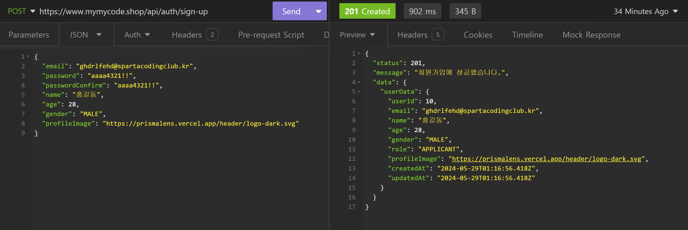

- 로그인 API
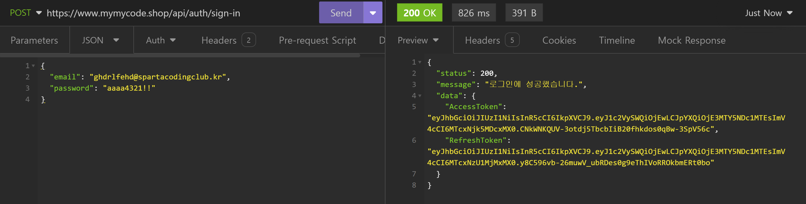

- 내 정보 조회 API
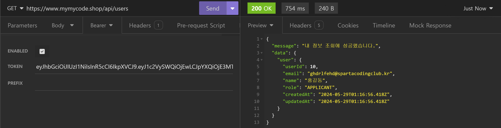

- 이력서 생성 API
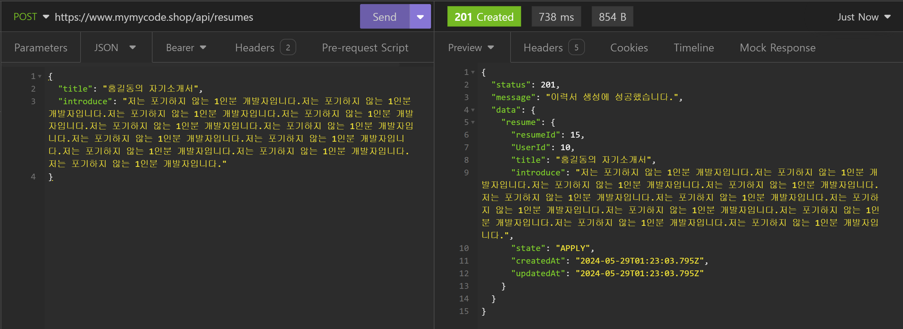

- 이력서 목록 조회 API
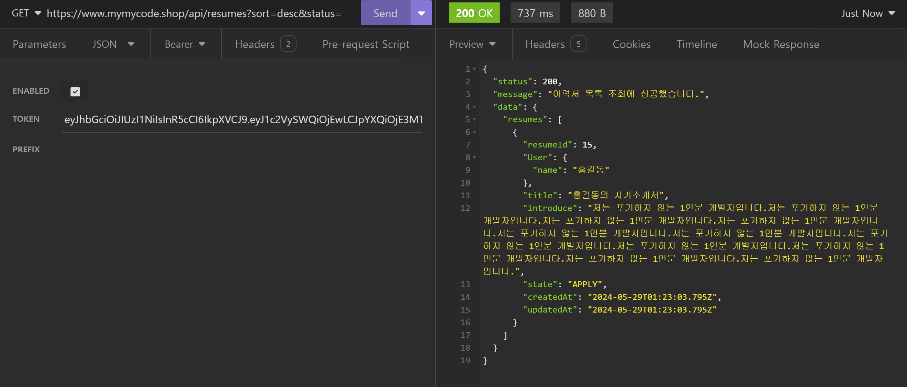

- 이력서 상세 조회 API
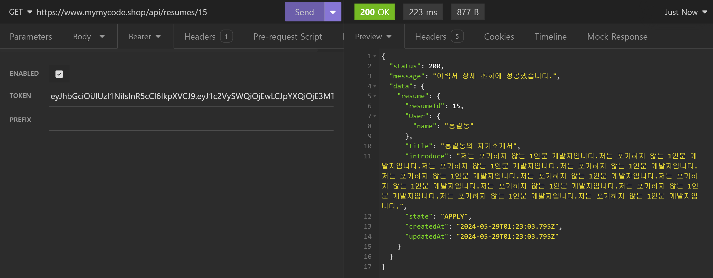

- 이력서 수정 API
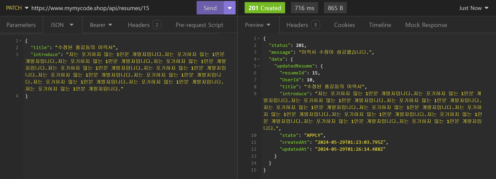

- 이력서 삭제 API
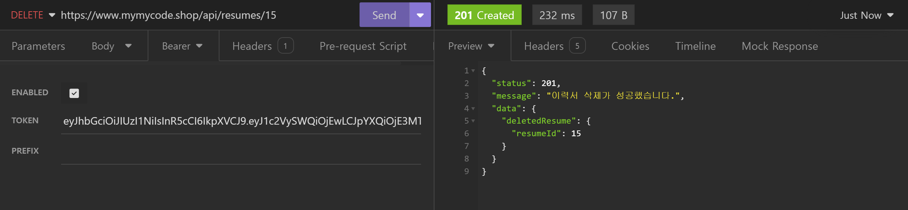

- 이력서 지원 상태 변경 API
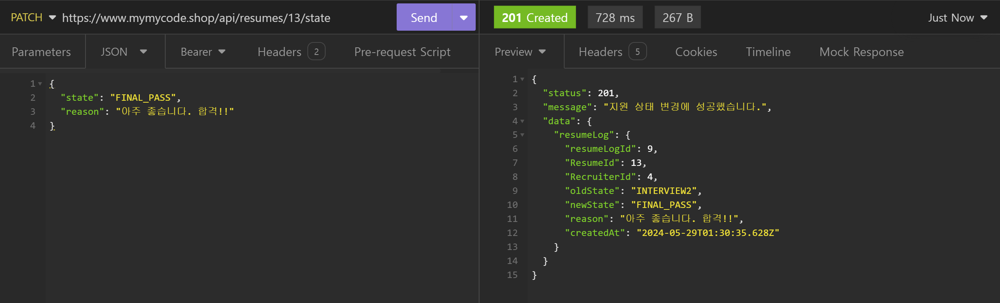

- 이력서 로그 목록 조회 API
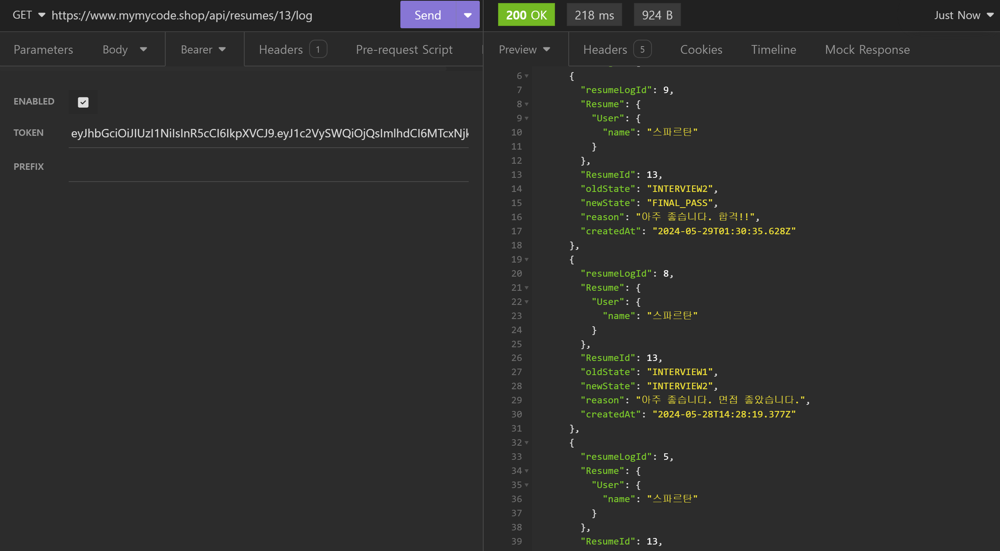

- 토큰 재발급 API
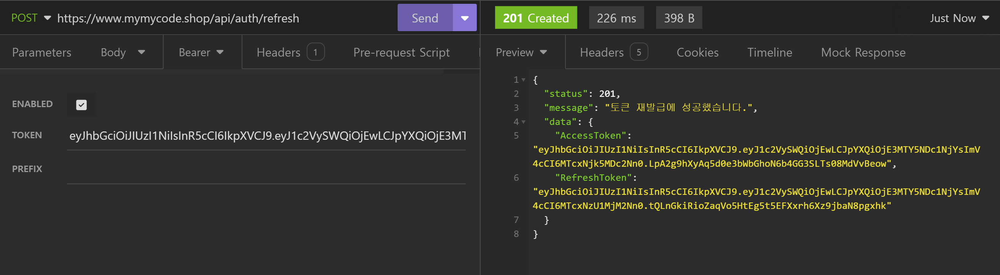

- 로그아웃 API
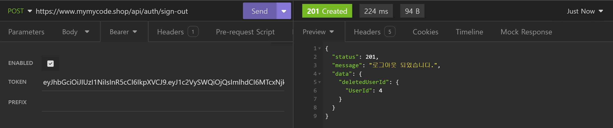

<br>

## 6. 어려웠던 점
> 이번 과제는 코드 구현의 어려움보다는 이게 왜 이렇게 되는지를 이해하는게 어려웠음
<br>

### 6-1. 토큰 생성 시 req.headers에 authorization이 자동으로 만들어짐
- 기존에 쿠키에 AccessToken을 넣는 방식에서 헤더에 넣는 방식으로 변경함

- 헤더에 토큰을 넣는 방식은 직접 Insomnia에서 Auth메뉴에 토큰을 복붙하는 방식임

- 로그인 후 auth.middleware를 사용하는 API에서 req.headers를 출력하니 authorization이라는 이름의 토큰이 생성되었음


- 생각해보면 나는 헤더에 authorization이라는 이름의 값을 넣어준 적이 없음

- 그냥 Insomnia의 Auth에 로그인 후 반환된 토큰값을 넣어줬음

- 팀원들에게 물어보니 정답을 찾을 수 있었음

- https://docs.insomnia.rest/insomnia/authentication#bearer-token


- 결과적으로 저 authorization은 Insomnia에서 자동으로 만들어서 header에 넣어준 것임

- 그냥 Insomnia에서 편의성을 제공해준 것임


<br>

### 6-2. 로그아웃을 해도 기능들을 사용할 수 있음
- 처음에는 로그아웃을 통해 RefreshToken을 삭제하면 진짜 로그아웃 기능처럼 다른 기능들을 사용할 수 없는 줄 알았음

- 하지만 정상적으로 로그아웃 기능을 구현 후 로그아웃을 진행해도 다른 API들을 사용할 수 있었음

- 너무 단순하게 생각했음

- 이번 과제에서 구현한 방식은 AccessToken과 RefreshToken을 사용하는 인증 방식임

- AccessToken에는 만료 시간을 짧게 하고, RefreshToken에는 만료 시간을 비교적 길게 만듦

- 이를 통해 AccessToken이 만료되면 다시 DB에 있는 RefreshToken를 통해 토큰들을 재발급 받는 구조임

- 여기서 AccessToken은 백엔드에서 처리할 수 있는 토큰이 아님

- 로그인을 하면 클라이언트에게 AccessToken을 넘겨줌

- 이후 AccessToken은 클라이언트에서 다뤄지는 데이터임

- 그렇기에 서버측에서는 AccessToken을 삭제하는 것이 불가능 